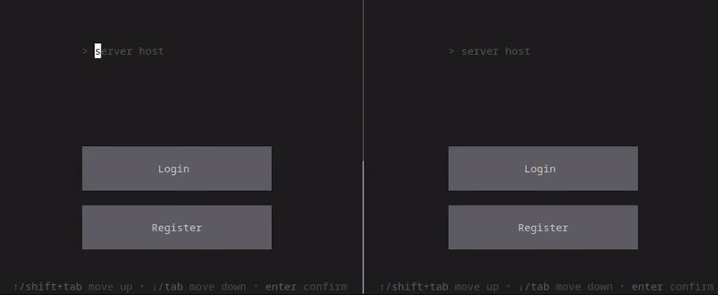

> :warning: DISCLAIMER:
> Code in this repo can be a bit messy. I created this app while learning Go and wanted to try as much as I could without spending too much time.

This repo contains a simple chat implementation in Go, which consists of web server and TUI client.
Here is a small demo:

